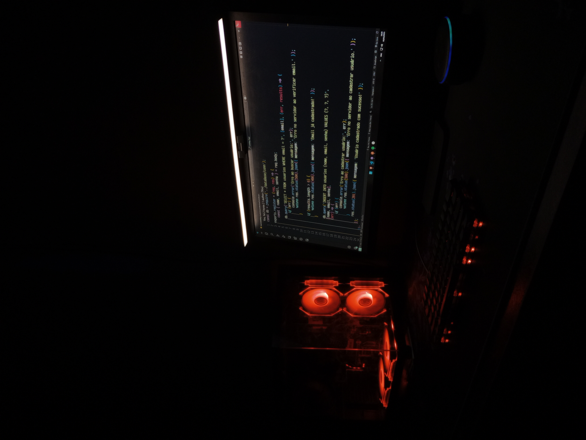

<!-- ✨ PERFIL GITHUB: DevVitorLevi -->
<!-- ✨ Header Ondulado -->

  

<!-- Centralização absoluta com Flexbox -->

---

<h2 align="left">Sobre Mim 🙋🏾‍♂️</h2>

  Sou desenvolvedor FullStack com foco em backend, formado em Técnico de Desenvolvimento de Sistemas.
  Tenho 17 anos e 2 anos de experiência em desenvolvimento de aplicações web, criação e manutenção de APIs RESTfuls
  e integração com bancos de dados relacionais e não relacionais, utilizando ORMs como <strong>Sequelize</strong> (para MySQL)
  e ODMs como <strong>Mongoose</strong> (para MongoDB), garantindo mapeamento eficiente entre objetos de aplicação e persistência de dados.

  Domino tecnologias como <strong>JavaScript</strong>, <strong>TypeScript</strong>, <strong>ReactJS</strong>, <strong>NodeJS</strong> e <strong>TailwindCSS</strong>,
  além de ferramentas de versionamento e pipelines CI/CD (<strong>Git</strong>, <strong>GitHub</strong>, <strong>Postman</strong>).
  Também atuo com automação de testes E2E utilizando <strong>Cypress</strong> e <strong>Gherkin BDD</strong>, garantindo qualidade e confiabilidade das aplicações.

  Aplicando boas práticas de desenvolvimento como <strong>Clean Code</strong>, arquitetura <strong>MVC</strong> e metodologias ágeis como
  <strong>Scrum</strong> e <strong>Kanban</strong>, tenho aprimorado organização, eficiência e qualidade em projetos complexos ao longo da minha trajetória.

---

<h2 align="left">GitHub Analytics 📊</h2>

  
  

---

<h2 align="left">Tecnologias ⚙️</h2>

  

---

<h2 align="left">Social Media 📬</h2>

  
  

  

