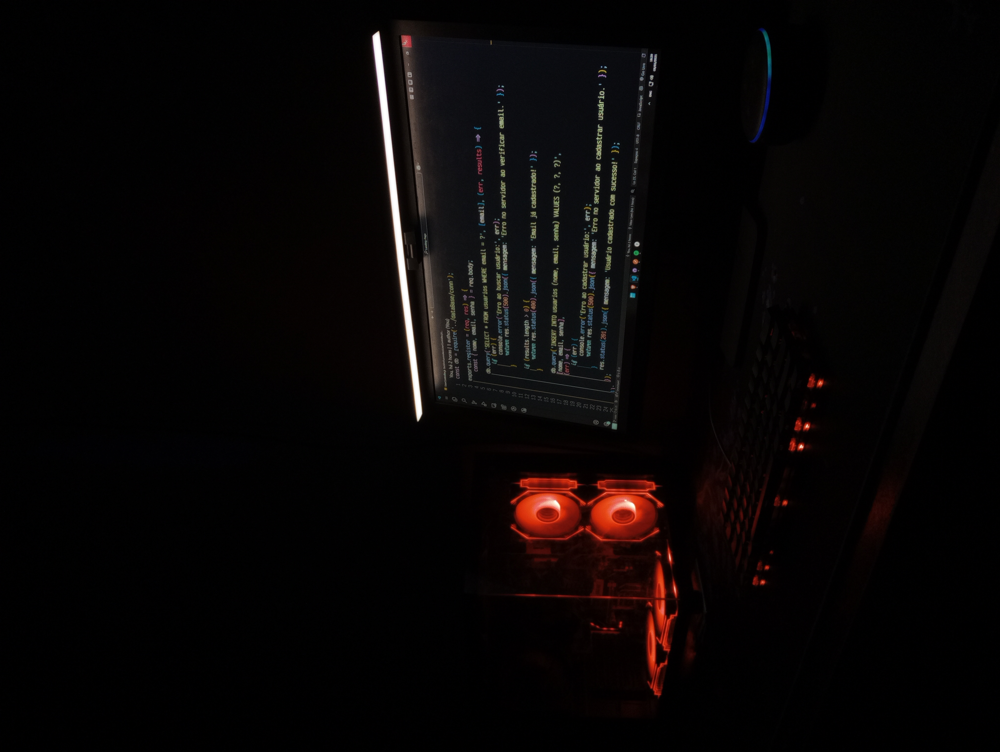

<!-- ✨ Header Ondulado -->

  

---

<h2 align="left">Sobre Mim 🙋🏾‍♂️</h2>

  Sou <strong>Desenvolvedor Full Stack</strong> e <strong>Técnico em Desenvolvimento de Sistemas</strong>,
  com foco em <strong>backend</strong> e arquitetura de aplicações web.
  Tenho <strong>17 anos</strong> e experiência prática no desenvolvimento de APIs RESTful,
  sistemas web completos e integrações com bancos de dados relacionais e não relacionais.

  Atuo principalmente com <strong>TypeScript</strong>, <strong>Node.js</strong> e <strong>React</strong>,
  aplicando princípios como <strong>Clean Code</strong>, <strong>separação de responsabilidades</strong>
  e boas práticas de modelagem de domínio.
  Tenho experiência com ORMs como <strong>Sequelize</strong> e <strong>Prisma</strong>,
  além de ODMs como <strong>Mongoose</strong>.

  Trabalho com <strong>testes automatizados</strong> (E2E e unitários) utilizando
  <strong>Cypress</strong>, <strong>Vitest</strong> e <strong>BDD com Gherkin</strong>,
  buscando confiabilidade, manutenibilidade e evolução segura do código.
  Em projetos colaborativos, utilizo <strong>Git</strong>, <strong>GitHub</strong>
  e metodologias ágeis como <strong>Scrum</strong> e <strong>Kanban</strong>.

---

<h2 align="left">Tecnologias ⚙️</h2>

  

<h2 align="left">GitHub Analytics 📊</h2>

  
  
  
  

<h2 align="left">Contato & Social 📬</h2>

  

  

<!-- ✨ Footer Ondulado -->

  

